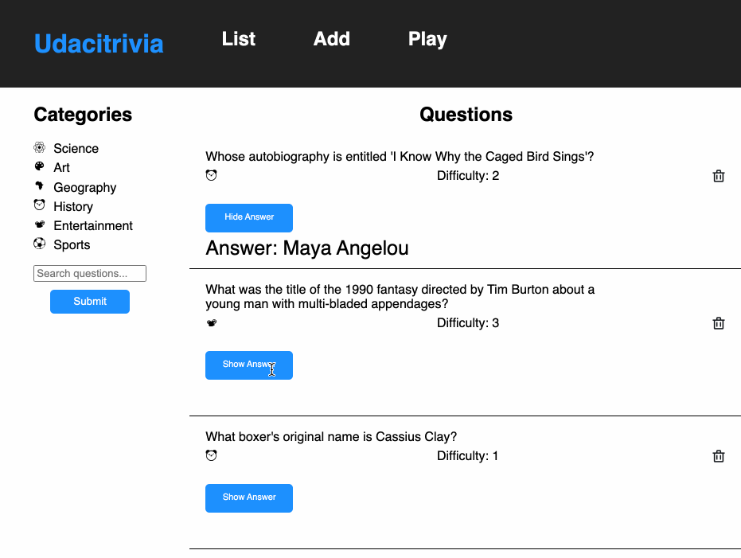

# Full Stack API Final Project

## Full Stack Trivia

Webpage to manage the trivia app and play the game.

The application must:

1) Display questions - both all questions and by category. Questions show the question, category and difficulty rating by default and can show/hide the answer. 
2) Delete questions.
3) Add questions and require that they include question and answer text.
4) Search for questions based on a text query string.
5) Play the quiz game, randomizing either all questions or within a specific category. 

With this project I had ability to structure plan, implement, and test an API.

### Backend

The `./backend` directory contains a partially completed Flask and SQLAlchemy server.
[View the README.md within ./backend for more details.](./backend/README.md)

### Frontend

The `./frontend` directory contains a complete React frontend to consume the data from the Flask server.

[View the README.md within ./frontend for more details.](./frontend/README.md)
